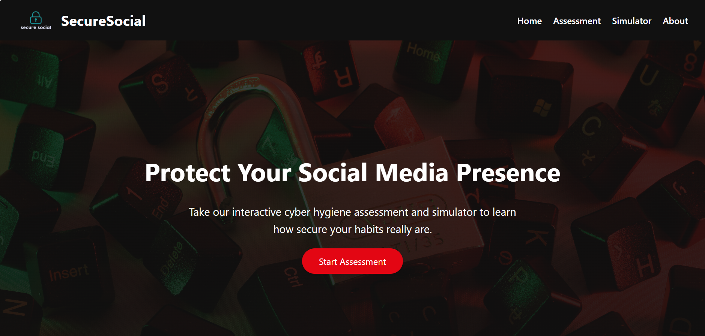
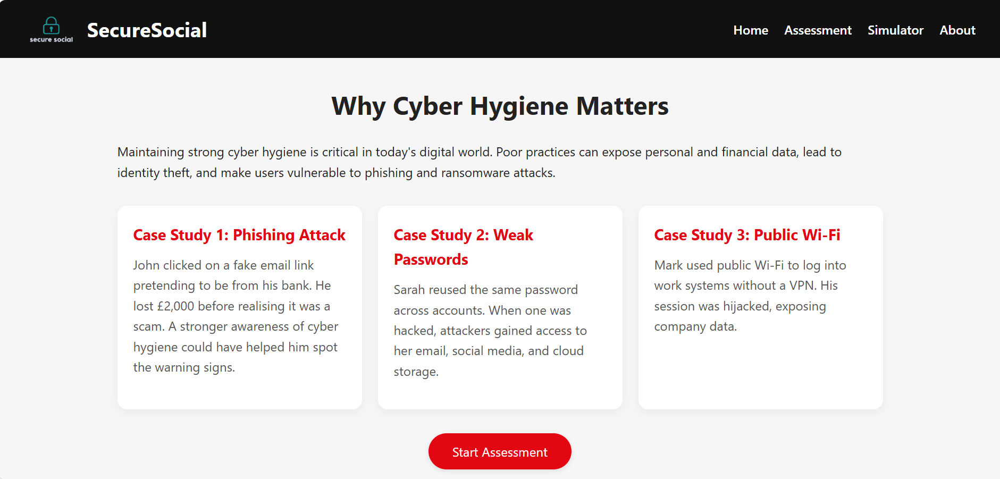
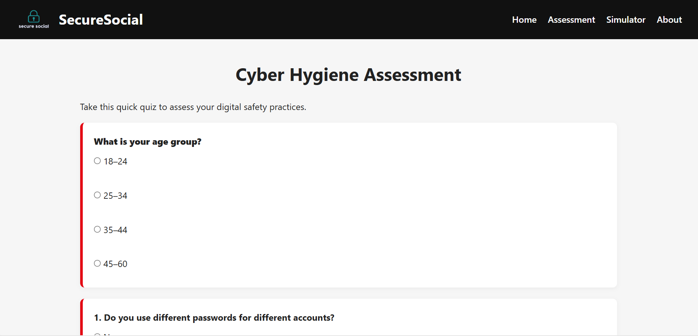
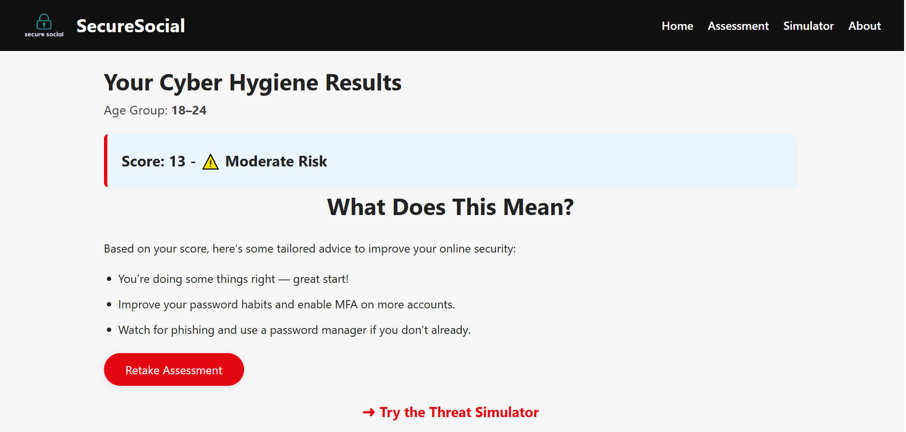
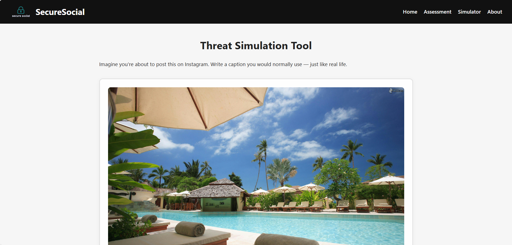
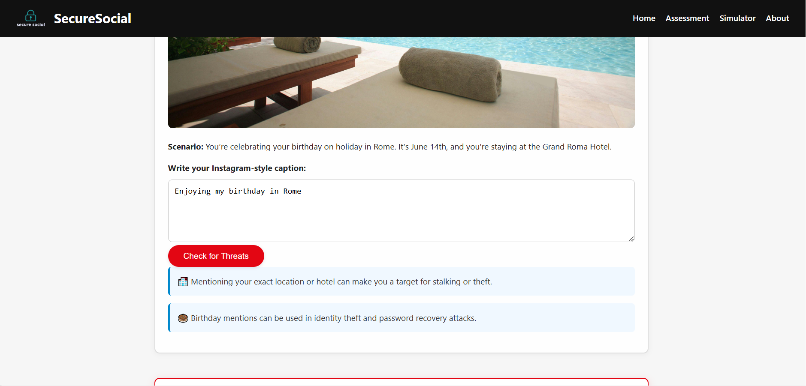
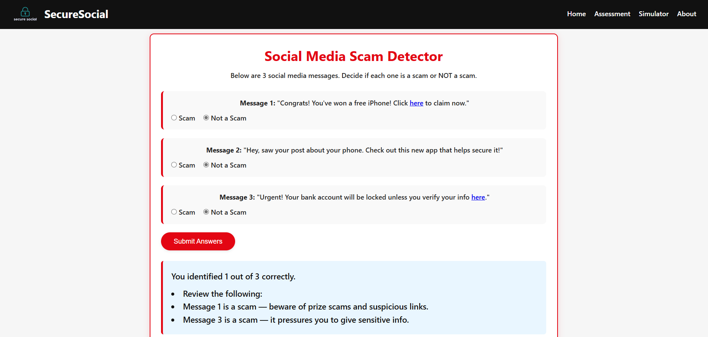
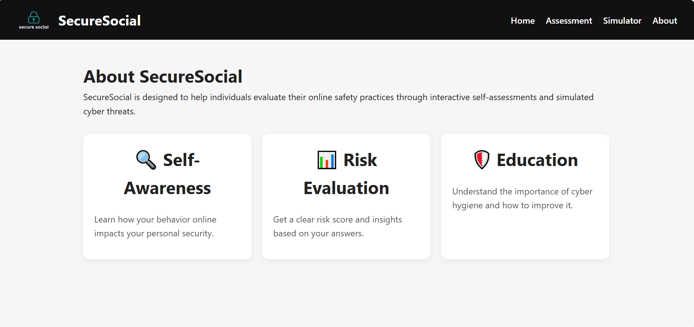

# Cyber-Hygiene-Web-App

<h2>Description</h2>
This web application is designed to promote safer social media behavior by helping users identify and understand their cybersecurity weaknesses. The app includes an interactive cyber hygiene assessment and two realistic simulations that demonstrate common online threats. Based on user responses, the app provides personalised feedback and tips to help improve digital habits.
 

<h2>Technologies Used</h2>
- <b>HTML</b> 
- <b>CSS</b> 
- <b>JavaScript</b> 

 

<h2>Environment Used</h2>
- <b>XAMPP / MAMP</b> (for local hosting and database) 
- <b>Visual Studio Code</b> 
- <b>phpMyAdmin</b>
 

<h2>Key Features</h2>
<ul>
  <li><b>Cyber Hygiene Assessment:</b> A multiple-choice quiz to evaluate user behavior and awareness</li>
  <li><b>Simulation 1:</b> A phishing message scenario that challenges users to spot warning signs</li>
  <li><b>Simulation 2:</b> An instagram capption simulation to teahc users what content is unsafe to include in captions</li>
  <li><b>Personalised Feedback:</b> Users receive feedback and tips from the assessment and simulations tailored to their performance</li>
  <li><b>Responsive Layout:</b> Works across desktops, tablets, and mobile devices</li>
</ul>

<h2>Contribution</h2>
This was a collaborative university project developed in a small group.  
Our team worked together on both the front-end and back-end components.  
Main responsibilities were:

- <b>[Your Name]</b>: Assessment form logic, UI styling, and responsive layout  
- <b>[Partner's Name]</b>: Simulation logic, feedback engine, and database integration

> *Replace the placeholder names with actual contributors.*
 

<h2>Screenshots</h2>

<b>Home Page</b> 

  

<b>Cyber Hygiene Assessment Page</b> 

  

<b>Cyber Hygiene Assessment</b> 

  

<b>Cyber Hygiene Assessment</b> 

  

<b>Feedback Results Page</b> 

  

<b>Instagram Simulation</b> 

  

<b>Instagram Simulation</b> 

  

<b>Phishing Simulation</b> 

  

<b>About Page</b> 

  

<h2>Live Site</h2>
*Optional: If hosted, add the link here.* 
<a href="https://yourusername.github.io/cyber-hygiene-web-app" target="_blank">View Live Website</a>

